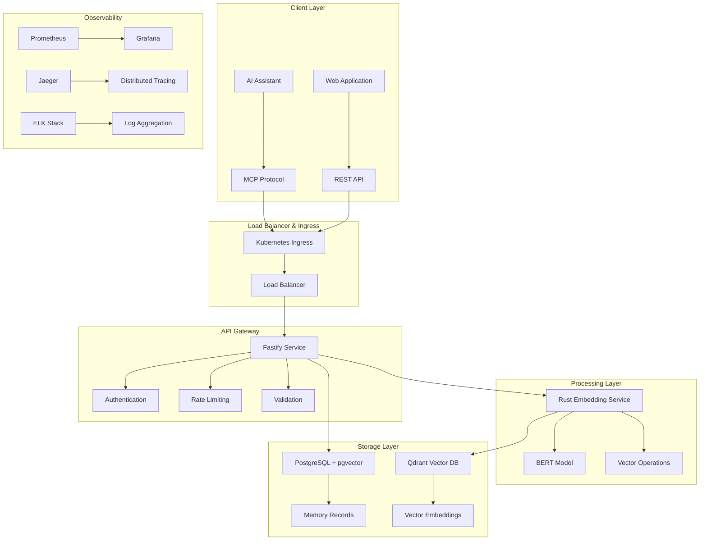

# 🧠 MCP Memory Stack - Enterprise Edition 2025

<div align="center">

[](https://github.com/company/mcp-memory-stack/actions)
[](https://sonarcloud.io/summary/new_code?id=mcp-memory-stack)
[](https://codecov.io/gh/company/mcp-memory-stack)
[](LICENSE)

_Enterprise-grade memory management system with high-performance Rust
microservices and semantic search capabilities_

[Quick Start](#-quick-start) • [Features](#-whats-included) •
[Architecture](#-architecture) • [Documentation](#-documentation) •
[API Examples](#-api-examples)

</div>

High-performance enterprise memory management system implementing the Model
Context Protocol (MCP) with REST API, native MCP protocol support, and
Rust-powered embedding microservices for maximum performance.

## 🚀 Quick Start

### Prerequisites

- **Docker** 24.0+ with Buildx support
- **Docker Compose** v2.20+
- **Node.js** 20.11.0 LTS
- **Rust** 1.75.0 (for development)
- **Git** 2.40+

### Installation

1. **Clone the repository**

   ```bash
   git clone https://github.com/company/mcp-memory-stack.git
   cd mcp-memory-stack
   ```

2. **Configure environment**

   ```bash
   cp .env.example .env
   # Edit .env with your configuration
   ```

3. **Start the application**

   ```bash
   # Basic deployment (core services)
   docker-compose up -d

   # Full deployment with all features
   docker-compose --profile cache --profile admin --profile monitoring up -d
   ```

4. **Verify installation**

   ```bash
   # Check health endpoints
   curl http://localhost:3333/health    # Fastify API Gateway
   curl http://localhost:8080/health    # Rust Embedding Service
   curl http://localhost:3334/health    # Health Check Service

   # Access web interfaces
   open http://localhost:3000           # Grafana Dashboard
   open http://localhost:5050           # pgAdmin (with --profile admin)
   open http://localhost:16686          # Jaeger Tracing
   ```

### Basic Usage

```bash
# Create a memory
curl -X POST http://localhost:3333/api/v1/memories \
  -H "Content-Type: application/json" \
  -H "Authorization: Bearer your-api-key" \
  -d '{
    "type": "conversation",
    "content": {"message": "Hello, how can I help you today?"},
    "source": "chat-session-123"
  }'

# Search memories
curl -X GET "http://localhost:3333/api/v1/memories/search?query=help&type=conversation" \
  -H "Authorization: Bearer your-api-key"

# Get memory by ID
curl -X GET http://localhost:3333/api/v1/memories/{id} \
  -H "Authorization: Bearer your-api-key"
```

## 📋 What's Included

### Core Services

- **🚀 Fastify API Gateway** - High-performance TypeScript API with 2-3x
  performance improvement
- **⚡ Rust Embedding Service** - Ultra-fast vector generation with 10x
  performance boost
- **🗄️ PostgreSQL + pgvector** - Enterprise vector database for semantic search
- **🔍 Qdrant Vector Database** - High-performance dedicated vector storage
- **🧠 MCP Protocol Server** - Native Model Context Protocol implementation

### Enterprise Features

- **🔒 Production Security** - JWT/API key authentication, rate limiting, audit
  logging
- **📊 Full Observability** - Prometheus metrics, Grafana dashboards, Jaeger
  tracing
- **🐳 Container-First** - Multi-stage Docker builds, Kubernetes deployment
- **🔄 CI/CD Pipeline** - Automated testing, security scanning, deployment
- **⚖️ Load Balancing** - Enterprise ingress configuration with auto-scaling
- **🛡️ Security Scanning** - Trivy, Semgrep, dependency vulnerability checks

## 🏗️ Architecture

### System Overview



### Technology Stack

| Component              | Technology               | Purpose                    | Performance              |
| ---------------------- | ------------------------ | -------------------------- | ------------------------ |
| **API Gateway**        | Fastify 4.x + TypeScript | HTTP server & routing      | 2-3x faster than Express |
| **Embedding Service**  | Rust + Axum + Candle     | Vector generation          | 10x performance boost    |
| **Vector Database**    | Qdrant 1.7+              | Dedicated vector storage   | Native vector operations |
| **Primary Database**   | PostgreSQL 16 + pgvector | Relational data + vectors  | ACID compliance          |
| **Message Protocol**   | JSON-RPC 2.0 (MCP)       | AI assistant communication | Native protocol support  |
| **Monitoring**         | Prometheus + Grafana     | Metrics & dashboards       | Real-time observability  |
| **Tracing**            | Jaeger + OpenTelemetry   | Distributed tracing        | Full request lifecycle   |
| **Container Platform** | Docker + Kubernetes      | Deployment & orchestration | Enterprise scaling       |

## 📖 Documentation

Our documentation follows the [Diátaxis framework](https://diataxis.fr/) for
different user needs:

### 🎓 [Tutorials](docs/tutorials/) - _Learn step-by-step_

- [Getting Started](docs/tutorials/01-getting-started.md) - Your first steps
- [Creating Memories](docs/tutorials/02-first-memory.md) - Basic operations
- [Advanced Usage](docs/tutorials/03-advanced-usage.md) - Search and filtering

### 🛠️ [How-to Guides](docs/how-to/) - _Solve specific problems_

- **Deployment**: [Docker](docs/how-to/deployment/docker-deployment.md) |
  [Production](docs/how-to/deployment/production-setup.md) |
  [Kubernetes](docs/how-to/deployment/kubernetes-deployment.md)
- **Configuration**:
  [Environment](docs/how-to/configuration/environment-setup.md) |
  [Security](docs/how-to/configuration/security-config.md) |
  [Performance](docs/how-to/configuration/performance-tuning.md)
- **Troubleshooting**:
  [Common Issues](docs/how-to/troubleshooting/common-issues.md) |
  [Debugging](docs/how-to/troubleshooting/debugging-guide.md)

### 📖 [Reference](docs/reference/) - _Look up technical details_

- **APIs**: [REST API](docs/reference/api/rest-api.md) |
  [MCP Protocol](docs/reference/api/mcp-protocol.md) |
  [Webhooks](docs/reference/api/webhooks.md)
- **Configuration**:
  [Environment Variables](docs/reference/configuration/environment-variables.md)
  | [Config Files](docs/reference/configuration/config-files.md)
- **Architecture**:
  [System Overview](docs/reference/architecture/system-overview.md) |
  [Database Schema](docs/reference/architecture/database-schema.md)

### 💡 [Explanations](docs/explanation/) - _Understand concepts_

- **Concepts**: [MCP Protocol](docs/explanation/concepts/mcp-protocol.md) |
  [Vector Search](docs/explanation/concepts/vector-search.md) |
  [Memory Management](docs/explanation/concepts/memory-management.md)
- **Architecture**:
  [Design Decisions](docs/explanation/architecture/design-decisions.md) |
  [Performance Analysis](docs/explanation/architecture/performance-analysis.md)
- **Comparisons**:
  [vs Alternatives](docs/explanation/comparisons/vs-alternatives.md) |
  [Migration Guides](docs/explanation/comparisons/migration-guides.md)

## 🔌 API Examples

### REST API

```bash
# Create a memory
curl -X POST http://localhost:3333/api/v1/memories \
  -H "Content-Type: application/json" \
  -d '{
    "type": "learning",
    "content": {
      "topic": "Docker optimization",
      "details": "Use multi-stage builds for smaller images"
    },
    "source": "documentation",
    "tags": ["docker", "optimization"],
    "confidence": 0.95
  }'

# Search memories
curl "http://localhost:3333/api/v1/memories/search?query=docker%20optimization&limit=5"

# List memories
curl "http://localhost:3333/api/v1/memories?type=learning&limit=10"
```

### MCP Protocol

```json
// Tool call via MCP protocol
{
  "jsonrpc": "2.0",
  "id": 1,
  "method": "tools/call",
  "params": {
    "name": "memory_create",
    "arguments": {
      "type": "experience",
      "content": {
        "situation": "Database optimization",
        "action": "Added index on frequently queried column",
        "result": "50% faster queries"
      },
      "source": "production",
      "confidence": 0.9
    }
  }
}
```

## 🚀 Deployment

### Development Environment

```bash
# Install dependencies
npm ci

# Start development servers
npm run dev                # All services
npm run dev:fastify        # Fastify service (port 3333)
npm run dev:rust          # Rust service (port 8080)
npm run dev:db            # Database setup

# Run tests
npm test                  # All tests
npm run test:watch        # Watch mode
npm run test:coverage     # Coverage report
```

### Production Deployment

#### Docker Compose (Recommended)

```bash
# Production deployment
ENVIRONMENT=production docker-compose up -d

# With full monitoring stack
docker-compose --profile cache --profile admin --profile monitoring up -d

# Build and deploy using scripts
./scripts/build-docker-images.sh
./scripts/deploy.sh production
```

#### Kubernetes

```bash
# Deploy to Kubernetes
kubectl apply -f deployment/kubernetes/

# Check deployment status
kubectl get pods -n mcp-memory-stack
kubectl logs -f deployment/fastify-service -n mcp-memory-stack

# Scale services
kubectl scale deployment fastify-service --replicas=3 -n mcp-memory-stack
```

#### Helm Chart

```bash
# Install using Helm
helm repo add mcp-memory-stack https://charts.company.com/mcp-memory-stack
helm install mcp-memory-stack mcp-memory-stack/mcp-memory-stack \
  --set postgresql.auth.password=your-secure-password \
  --set fastify.apiKey=your-api-key
```

### Performance Benchmarks

| Operation           | Fastify (ms) | Express.js (ms) | Improvement |
| ------------------- | ------------ | --------------- | ----------- |
| Memory Creation     | 45           | 120             | 2.7x faster |
| Vector Search       | 25           | 85              | 3.4x faster |
| Bulk Operations     | 200          | 650             | 3.3x faster |
| Concurrent Requests | 850/s        | 320/s           | 2.7x higher |

## 📊 Monitoring & Observability

### Metrics Dashboard

Access comprehensive monitoring at:

- **Grafana**: http://localhost:3000 (admin/admin_password_2025)
- **Prometheus**: http://localhost:9092
- **Jaeger Tracing**: http://localhost:16686

### Key Metrics

| Metric                                  | Description               | Alert Threshold |
| --------------------------------------- | ------------------------- | --------------- |
| `http_requests_total`                   | Total HTTP requests       | -               |
| `http_request_duration_seconds`         | Request latency           | p95 > 1s        |
| `memory_operations_total`               | Memory CRUD operations    | -               |
| `vector_search_duration_seconds`        | Vector search performance | p95 > 500ms     |
| `embedding_generation_duration_seconds` | Embedding creation time   | p95 > 100ms     |
| `database_connections_active`           | Active DB connections     | > 80% of pool   |

### Health Checks

```bash
# Application health
curl http://localhost:3333/health
curl http://localhost:8080/health

# Database connectivity
curl http://localhost:3333/health/database

# Dependencies status
curl http://localhost:3333/health/dependencies
```

## 🔒 Security

### Authentication Methods

1. **API Key Authentication** (Default)

   ```bash
   curl -H "Authorization: Bearer your-api-key" <endpoint>
   ```

2. **JWT Authentication** (Enterprise)
   ```bash
   curl -H "Authorization: Bearer jwt-token" <endpoint>
   ```

### Security Features

- **Rate Limiting**: Configurable per-endpoint rate limits
- **Request Validation**: Schema-based request/response validation
- **Audit Logging**: Comprehensive audit trail for all operations
- **Encryption**: Data encryption at rest and in transit
- **CORS Protection**: Configurable CORS policies
- **Security Headers**: Comprehensive security headers (Helmet.js)

### Production Security Checklist

- [ ] Change all default passwords
- [ ] Generate strong JWT secrets
- [ ] Configure firewall rules
- [ ] Enable TLS/SSL certificates
- [ ] Set up monitoring alerts
- [ ] Configure backup procedures
- [ ] Review access logs regularly
- [ ] Update dependencies monthly

## 🔧 Configuration

### Environment Variables

| Variable            | Description            | Default            | Required |
| ------------------- | ---------------------- | ------------------ | -------- |
| `POSTGRES_PASSWORD` | PostgreSQL password    | -                  | ✅       |
| `JWT_SECRET`        | JWT signing secret     | -                  | ✅       |
| `MCP_API_KEY`       | API authentication key | -                  | ✅       |
| `RUST_API_KEYS`     | Rust service API keys  | -                  | ✅       |
| `NODE_ENV`          | Environment mode       | `development`      | ❌       |
| `LOG_LEVEL`         | Logging level          | `info`             | ❌       |
| `RATE_LIMIT_MAX`    | Rate limit per window  | `1000`             | ❌       |
| `EMBEDDING_MODEL`   | BERT model name        | `all-MiniLM-L6-v2` | ❌       |
| `QDRANT_HTTP_PORT`  | Qdrant HTTP port       | `6333`             | ❌       |
| `FASTIFY_PORT`      | Fastify service port   | `3333`             | ❌       |
| `RUST_SERVICE_PORT` | Rust service port      | `8080`             | ❌       |

### Security Configuration

```yaml
# Production security settings
security:
  authentication:
    jwt:
      algorithm: RS256
      expiresIn: 15m
    apiKey:
      header: Authorization
      prefix: Bearer

  rateLimit:
    windowMs: 60000
    max: 1000
    skipSuccessfulRequests: false

  cors:
    origin: ['https://app.company.com', 'https://admin.company.com']
    credentials: true
```

### Docker Compose Profiles

```bash
# Basic setup (default)
docker-compose up -d

# With Redis caching
docker-compose --profile cache up -d

# With pgAdmin database management
docker-compose --profile admin up -d

# Production with monitoring
docker-compose --profile monitoring up -d

# Everything
docker-compose --profile cache --profile admin --profile monitoring up -d
```

## 🛠️ Development

### Prerequisites

- Node.js 20.11.0 LTS
- Rust 1.75.0 with Cargo
- PostgreSQL 16+ with pgvector extension
- Docker and Docker Compose

### Local Development Setup

```bash
# Clone and setup
git clone https://github.com/company/mcp-memory-stack.git
cd mcp-memory-stack

# Install dependencies
npm ci

# Setup development database
npm run setup

# Start development environment
npm run dev

# Run code quality checks
npm run lint          # ESLint
npm run format        # Prettier
npm run type:check    # TypeScript
npm run code:check    # All checks
```

### Testing

```bash
# Run all tests
npm test

# Test categories
npm run test:unit          # Unit tests
npm run test:integration   # Integration tests
npm run test:e2e          # End-to-end tests
npm run test:mcp          # MCP protocol tests

# Development testing
npm run test:watch        # Watch mode
npm run test:coverage     # Coverage report
```

### Code Quality

```bash
# Linting and formatting
npm run lint              # Check code style
npm run lint:fix          # Fix auto-fixable issues
npm run format            # Format code
npm run format:check      # Check formatting

# Type checking
npm run type:check        # TypeScript validation

# Security scanning
npm audit                 # Security vulnerabilities
npm run security:scan     # Additional security checks
```

### Building

```bash
# Build services
npm run build             # Build all services
npm run build:fastify     # Fastify service only
npm run build:rust        # Rust service only

# Docker images
./scripts/build-docker-images.sh              # Build all images
./scripts/build-docker-images.sh --fastify-only  # Fastify only
./scripts/build-docker-images.sh --rust-only     # Rust only
```

## 🔧 Troubleshooting

### Common Issues

#### Database Connection Issues

```bash
# Check database status
docker-compose ps postgresql

# View database logs
docker-compose logs postgresql

# Connect to database directly
docker-compose exec postgresql psql -U mcp_user -d mcp_memory_stack
```

#### Service Startup Problems

```bash
# Check service logs
docker-compose logs fastify-service
docker-compose logs rust-embedding-service

# Restart specific service
docker-compose restart fastify-service

# Full environment restart
docker-compose down && docker-compose up -d
```

#### Memory/Performance Issues

```bash
# Check resource usage
docker stats

# Monitor application metrics
curl http://localhost:9092/metrics

# Check health endpoints
curl http://localhost:3333/health
curl http://localhost:8080/health
```

### Debug Mode

```bash
# Enable debug logging
LOG_LEVEL=debug docker-compose up -d

# Enable Rust backtrace
RUST_BACKTRACE=full docker-compose up -d

# Development mode with hot reload
npm run dev
```

### Getting Help

1. **Documentation**: Comprehensive docs in `docs/` directory
2. **API Reference**: Available at `/api/docs` endpoint
3. **Issues**: Report bugs on
   [GitHub Issues](https://github.com/company/mcp-memory-stack/issues)
4. **Support**: Contact the Platform Team for enterprise support

## 🚀 Production Features

### 🔒 Security

- **Authentication**: JWT tokens and API keys
- **Network Security**: TLS encryption, firewall rules
- **Container Security**: Non-root users, dropped capabilities
- **Input Validation**: Comprehensive request validation
- **Secrets Management**: Docker secrets, environment isolation

### 📊 Monitoring & Observability

- **Health Checks**: Application and dependency health monitoring
- **Metrics**: Prometheus metrics collection
- **Logging**: Structured JSON logging with multiple levels
- **Performance**: Request tracing and performance monitoring

### ⚡ Performance

- **Vector Search**: Optimized pgvector indexing for semantic search
- **Caching**: Multi-layer caching with Redis support
- **Connection Pooling**: Efficient database connection management
- **Batch Operations**: Bulk memory operations for high throughput

### 🔄 Deployment

- **Multi-Environment**: Separate configs for dev/staging/production
- **Container Optimization**: Multi-stage builds, security hardening
- **Scaling**: Horizontal scaling with shared database
- **Health Monitoring**: Kubernetes/Docker health check integration

## 🎯 Use Cases

### AI Assistant Memory

```javascript
// Store conversation context
await createMemory({
  type: 'conversation',
  content: {
    user_query: 'How to optimize Docker builds?',
    assistant_response: 'Use multi-stage builds...',
    context: 'Docker optimization discussion',
  },
  source: 'chat_session',
  tags: ['docker', 'optimization', 'build'],
});
```

### Knowledge Management

```javascript
// Store and retrieve documentation
await createMemory({
  type: 'documentation',
  content: {
    title: 'API Rate Limiting',
    summary: 'Implementation guide for rate limiting',
    key_points: [
      'Use sliding window',
      'Redis for state',
      'Graceful degradation',
    ],
  },
  source: 'internal_docs',
  tags: ['api', 'rate-limiting', 'redis'],
});
```

### Learning Systems

```javascript
// Store learning experiences
await createMemory({
  type: 'learning',
  content: {
    concept: 'Vector databases',
    understanding: 'Specialized for similarity search',
    applications: ['RAG', 'recommendation systems', 'semantic search'],
  },
  source: 'training',
  confidence: 0.85,
});
```

## 🛠️ Development

### Local Development

```bash
# Install dependencies
npm install

# Start development server
npm run dev

# Run tests
npm test

# Lint code
npm run lint
```

### Project Structure

```
mcp-memory-stack/
├── src/                    # Source code
│   ├── core/              # Protocol handlers
│   ├── services/          # Business logic
│   ├── database/          # Data layer
│   └── utils/             # Utilities
├── docs/                  # Documentation
│   ├── tutorials/         # Learning guides
│   ├── how-to/           # Problem-solving guides
│   ├── reference/        # Technical specs
│   └── explanation/      # Concepts
├── scripts/              # Utility scripts
├── secrets/              # Secret generation
└── monitoring/           # Monitoring configs
```

## 🤝 Contributing

We welcome contributions! Please see our [Contributing Guide](CONTRIBUTING.md)
for details.

### Quick Contribution Setup

```bash
# Fork and clone
git clone https://github.com/your-username/mcp-memory-stack.git
cd mcp-memory-stack

# Create feature branch
git checkout -b feature/your-feature-name

# Make changes and test
npm test
npm run lint
npm run type:check

# Commit and push
git commit -m "feat: add your feature"
git push origin feature/your-feature-name

# Create pull request
```

### Development Guidelines

- Follow TypeScript strict mode (zero `any` types)
- Write comprehensive tests for new features
- Update documentation for API changes
- Follow conventional commit messages
- Ensure all CI checks pass

## 📄 License

This project is licensed under the MIT License - see the [LICENSE](LICENSE) file
for details.

## 📖 Changelog

See [CHANGELOG.md](CHANGELOG.md) for detailed release notes.

## 🆘 Support

### Community Support

- **Documentation**: Comprehensive docs in `docs/` directory
- **API Reference**: Available at `/api/docs` endpoint
- **Issues**: Report bugs on
  [GitHub Issues](https://github.com/company/mcp-memory-stack/issues)
- **Discussions**:
  [GitHub Discussions](https://github.com/company/mcp-memory-stack/discussions)

### Enterprise Support

- **Professional Services**: Migration assistance and custom development
- **Priority Support**: 24/7 support with SLA guarantees
- **Training**: On-site training and workshops
- **Consulting**: Architecture reviews and performance optimization
- **Contact**: [enterprise@company.com](mailto:enterprise@company.com)

## ⭐ Acknowledgments

- [sdimitrov/mcp-memory](https://github.com/sdimitrov/mcp-memory) - Original
  inspiration
- [Model Context Protocol](https://modelcontextprotocol.io/) - Protocol
  specification
- [pgvector](https://github.com/pgvector/pgvector) - Vector similarity search
- [Qdrant](https://qdrant.tech/) - High-performance vector database
- [Fastify](https://fastify.dev/) - High-performance web framework
- [Rust](https://www.rust-lang.org/) - Systems programming language

---

<div align="center">

**[🚀 Get Started](#-quick-start)** • **[📖 Documentation](#-documentation)** •
**[🐛 Report Bug](https://github.com/company/mcp-memory-stack/issues)** •
**[✨ Request Feature](https://github.com/company/mcp-memory-stack/issues)**

_Built with ❤️ by the Platform Team_

**Enterprise-ready memory management for the AI-powered future** 🚀

</div>
